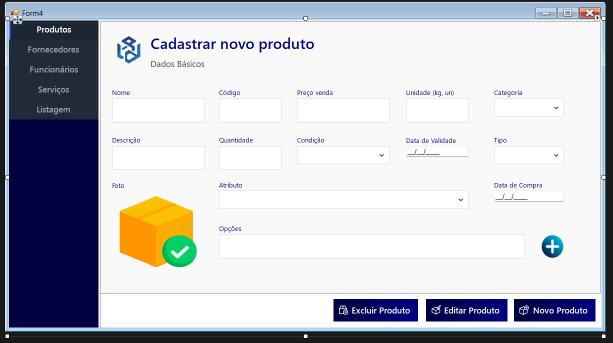

# Estoque Inteligente
Sistema de gerenciamento de estoque completo com interface web e desktop, desenvolvido para otimizar o controle de produtos, fornecedores e vendas.
## 🚀 Funcionalidades
- **Controle de Estoque**
  - Cadastro e gerenciamento de produtos
  - Controle de entrada e saída
  - Alertas de estoque baixo
  - Categorização de produtos
- **Gestão de Fornecedores**
  - Cadastro completo de fornecedores
  - Histórico de compras
  - Avaliação de fornecedores
- **Controle de Funcionários**
  - Gerenciamento de acesso
  - Registro de atividades
  - Níveis de permissão
- **Relatórios e Analytics**
  - Relatórios detalhados de vendas
  - Gráficos de desempenho
  - Análise de tendências
  - Exportação de dados
## 🛠️ Tecnologias Utilizadas
### Aplicação Desktop
- C# (.NET Framework 4.7.2)
- Windows Forms
- Guna UI Framework
- MySQL
### Interface Web
- HTML5
- CSS3
- JavaScript
- PHP
- MySQL
## 📦 Instalação
### Requisitos
- .NET Framework 4.7.2+
- MySQL Server
- Servidor Web (para interface web)
- PHP 7.4+
### Configuração do Banco de Dados
1. Execute o script SQL fornecido para criar o banco de dados
2. Configure as credenciais de acesso no arquivo de configuração
### Aplicação Desktop
1. Clone o repositório
2. Abra a solução no Visual Studio
3. Restaure os pacotes NuGet
4. Compile e execute o projeto
### Interface Web
1. Configure seu servidor web
2. Copie os arquivos da pasta `web` para o diretório do servidor
3. Configure as credenciais do banco de dados no arquivo de configuração PHP
## 👥 Equipe
- Alefer Marinho
- Glória Lagerstrom
- Gustavo Rodrigo
- Maria Vitória
## 📄 Licença
Este projeto está sob a licença MIT. Veja o arquivo [LICENSE](LICENSE) para mais detalhes.

---

# Screenshots

---

# Releases
[Baixar no Drive](https://drive.google.com/file/d/1FxyJWozPCdVReiFiYBejyNwAVcbNd9py/view?usp=sharing)